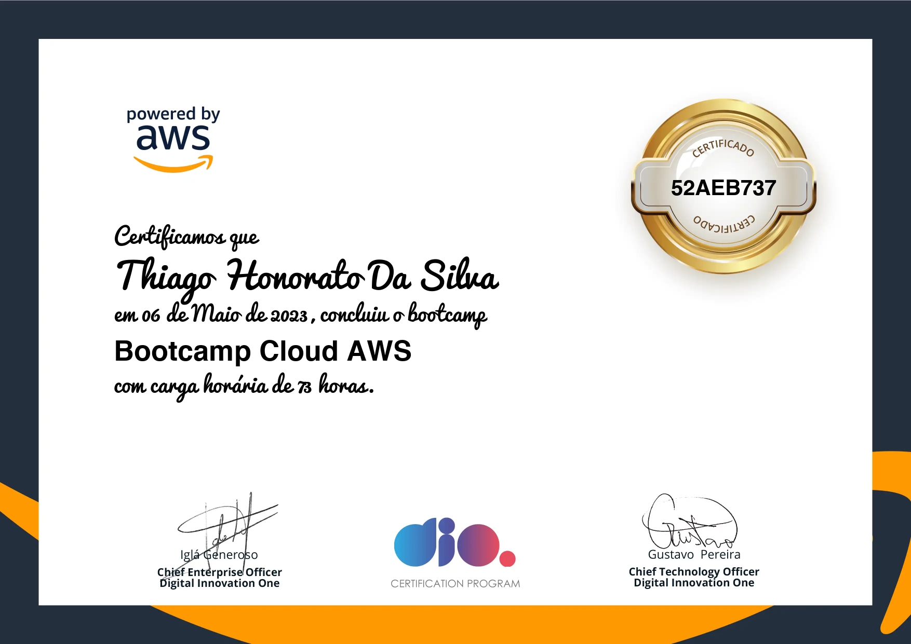

 

<h1 align="center">Bootcamp Cloud AWS</h1>
<h4 align="justify"> O Bootcamp Cloud AWS é uma parceria entre uma das maiores plataformas de serviços de computação em nuvem do mundo e da DIO, composto por 73 horas de conteúdo que vai do básico até o preparatório para certificações. A trilha foi composta por cursos exclusivos AWS e mentorias ao vivo com experts certificados pela plataforma. Foi uma grande oportunidade de conhecer as certificações AWS e ter destaque no currículo.</h4>

<h3 align="center">
⚙️ Tecnologias utilizadas

&nbsp;

</h3>

## Material de Apoio

- [Material de Apoio](https://github.com/ThiagoMonts/dio_bootcamp_aws/tree/main/material_de_apoio)

## Desafios de Código

- [Desafio 01](https://github.com/ThiagoMonts/dio_bootcamp_aws/tree/main/desafios/desafio01)
- [Desafio 02](https://github.com/ThiagoMonts/dio_bootcamp_aws/tree/main/desafios/desafio02)
- [Desafio 03](https://github.com/ThiagoMonts/dio_bootcamp_aws/tree/main/desafios/desafio03)
- [Desafio 04](https://github.com/ThiagoMonts/dio_bootcamp_aws/tree/main/desafios/desafio04)
- [Live Coding](https://github.com/ThiagoMonts/dio_bootcamp_aws/tree/main/desafios/live-coding01)

## Conclusão do Bootcamp: 06/05/2023

 

